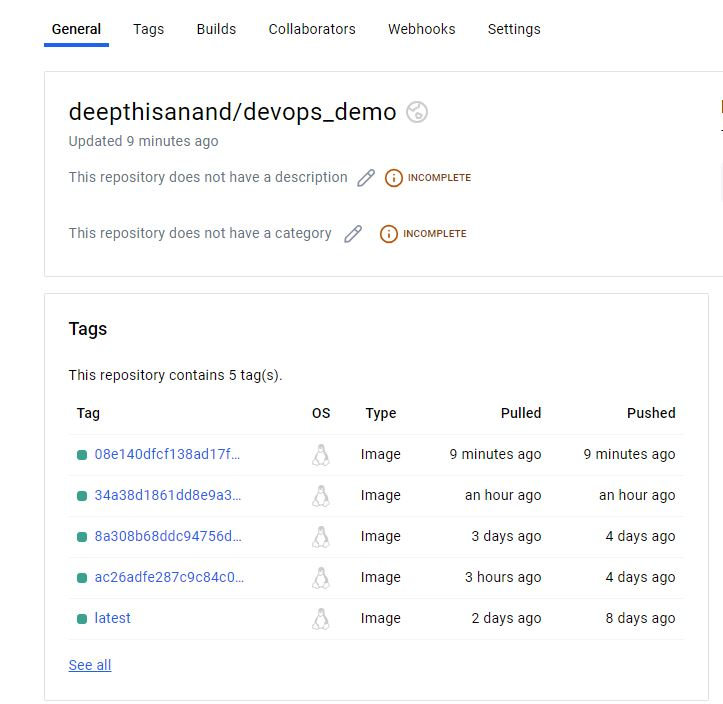

### Links to the closed issues:
[Issue 1: Missing SMTP Config](https://github.com/deepthisanand2024/hw10_event_manager/issues/1)
[Issue 2: Pytest test_users_schema Key and Validation Error](https://github.com/deepthisanand2024/hw10_event_manager/issues/3)
[Issue 3: Pytest test_users_API Create Token Error](https://github.com/deepthisanand2024/hw10_event_manager/issues/5)
[Issue 4: Role format mismatch](https://github.com/deepthisanand2024/hw10_event_manager/issues/8)
[Issue 5: User Role object with no attribute upper](https://github.com/deepthisanand2024/hw10_event_manager/issues/9)

### Link to project image deployed to Dockerhub:

### Lessons Learnt:
This assignment was an enriching experience that significantly bolstered both my technical skills and understanding of collaborative software development processes. From a technical standpoint, I delved deeper into the intricacies of ensuring code security, particularly through the use of SQL injection mitigation techniques and understanding how dependencies can impact overall application security. The task of scanning for vulnerabilities, specifically the one involving PyMySQL, underscored the importance of maintaining updated dependencies and implementing secure coding practices. This experience highlighted the critical nature of validating and sanitizing all inputs, especially when handling JSON data that interacts with SQL queries, to prevent injection attacks.

On the collaborative side, the assignment emphasized the value of thorough documentation and clear communication within a team. The process of identifying, documenting, and addressing specific issues required a methodical approach to both code and communication. Challenges included navigating differing interpretations of requirements and ensuring that all team members were aligned on the project goals. Implementing solutions such as updating libraries to their secure versions and enhancing test coverage required not just technical knowledge but also coordination and consensus-building among team members. This experience reinforced the need for continuous integration practices and the use of tools like GitHub for managing version control and automating security checks, ensuring that all team members contribute to a secure and efficient workflow.
